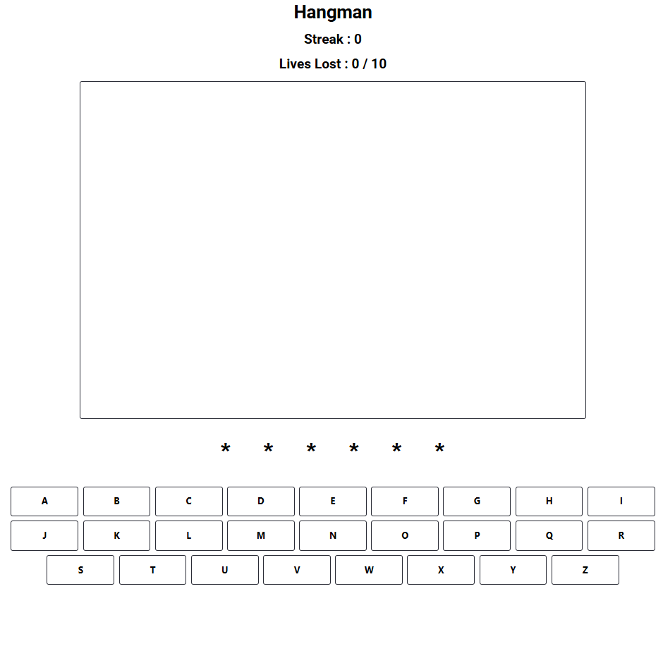
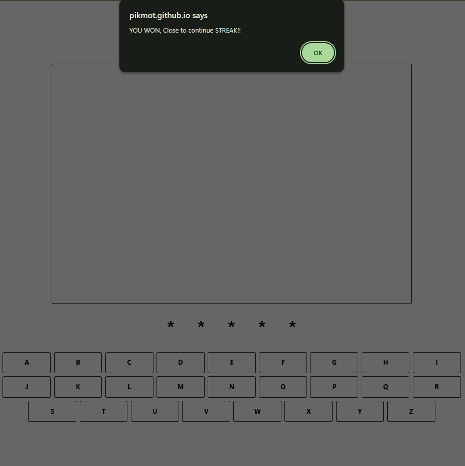
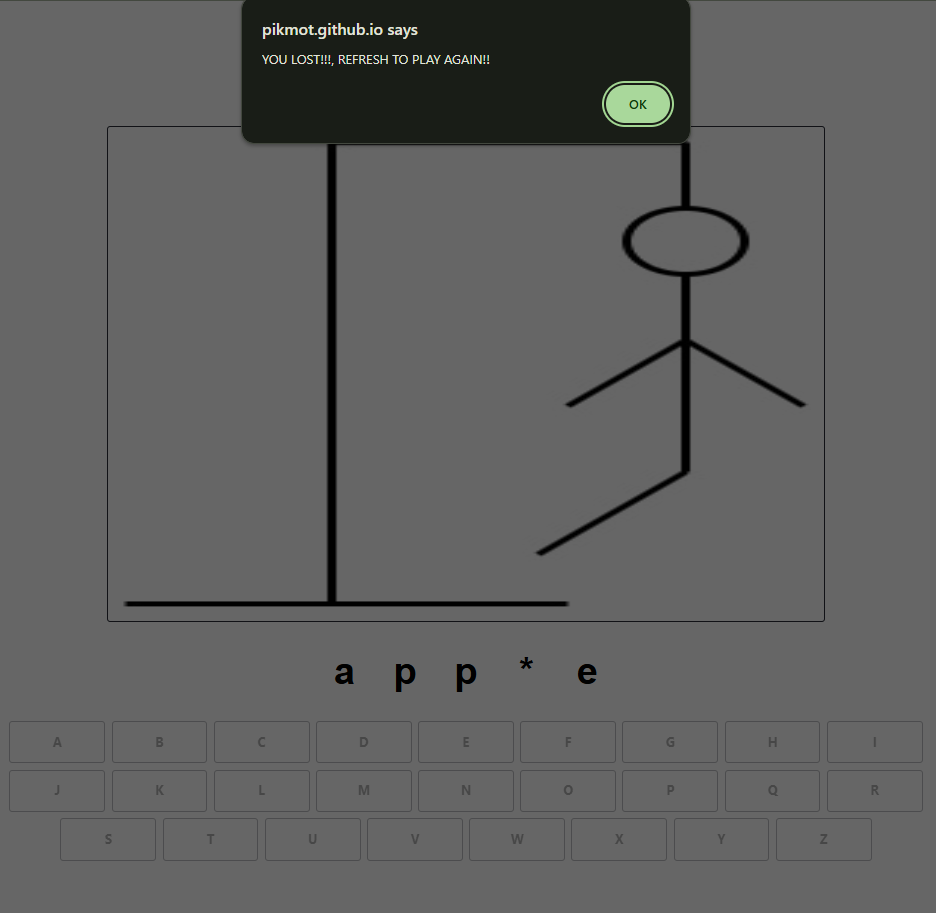

# Hangman project

Browser project built with Javascript, HTML and SASS.

[LIVE DEMO](https://pikmot.github.io/Hangman-Project/)

## Preview

### START SCREEN | WIN SCREEN | LOSS SCREEN

## MVP

- [x] Start game with random word read from .json file
- [x] Place holder for letters / Letters displayed when guessed
- [x] 26 avaliable inputs via **clicking** screen keyboard or actual keyboard
- [x] Correct guess reveals letter / Incorrect guess loses live and updates image
- [x] Game won when word is guessed + continue playing with streak
- [x] Game loss when lives loss reach 10
- [x] Game won/loss message displayed

## Techstack

- HTML5
- CSS/SASS
- JAVASCRIPT (ES6+)

# Takeaway

Project is part of \_Nology's boot camp and helps with solidifying my understanding of Javascript fundementals via Arrays, Iterators, DOM manipulation, Event Listeners & String manipulation.
